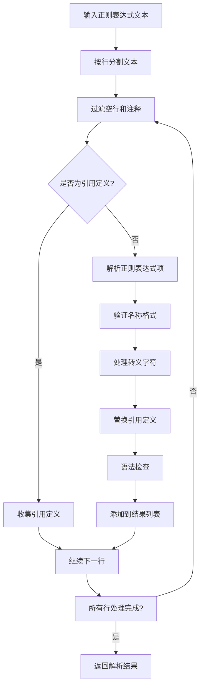
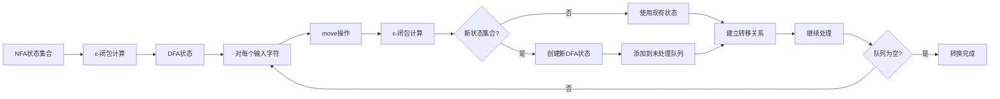
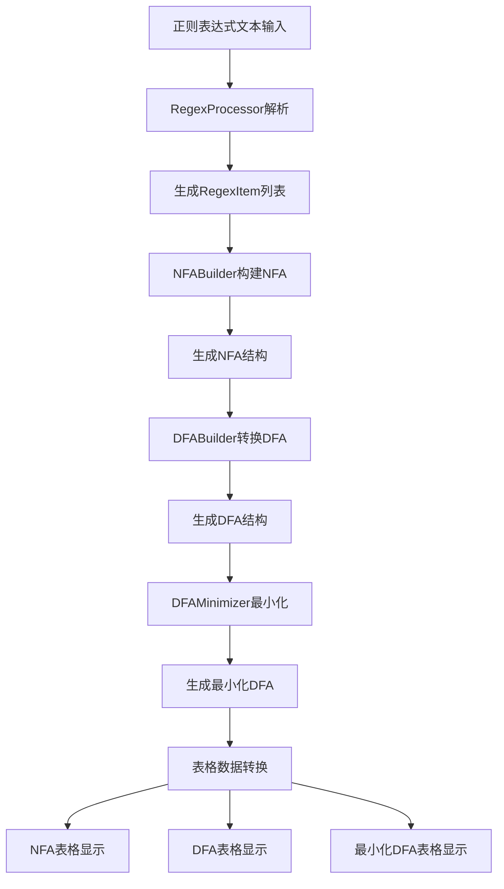

# 正则表达式处理流程技术文档

## 概述

本文档详细阐述正则表达式解析、NFA（非确定有限自动机）构建、DFA（确定有限自动机）转换以及DFA最小化的完整流程。文档采用清晰的章节结构，包含必要的文字说明、代码示例和辅助图片，确保技术细节准确且易于理解。

## 1. 正则表达式解析

### 1.1 核心数据结构定义

```cpp
// 正则表达式项结构
struct RegexItem {
    QString name;        // 正则表达式名称（如：_num100, _id100S）
    QString pattern;     // 正则表达式模式
    int code;            // 单词编码
    bool isMultiWord;    // 是否为多单词标识
};

// 正则表达式处理器类
class RegexProcessor {
private:
    QList<RegexItem> m_regexItems;      // 解析后的正则表达式项列表
    QString m_errorMessage;             // 错误信息
    QMap<QString, QString> m_regexReferences; // 引用定义映射
    
public:
    bool parse(const QString &text);    // 解析正则表达式文本
    QList<RegexItem> getRegexItems() const;
    QString getErrorMessage() const;
};
```

### 1.2 输入参数到表格列数据的转换算法

**输入格式规范：**
- 每行一个正则表达式定义
- 格式：`名称 = 模式`
- 注释以`//`开头
- 空行自动跳过

**解析步骤：**
1. **预处理阶段**：将输入文本按行分割，过滤空行和注释行
2. **引用收集阶段**：遍历所有行，收集不以下划线开头的名称作为引用定义
3. **正则表达式解析阶段**：逐行解析正则表达式项
4. **语法验证阶段**：验证名称格式和正则表达式语法

**字段映射关系：**
- 输入文本行 → RegexItem结构
- 名称字段 → 验证编码格式（_名称编码 或 _名称编码S）
- 模式字段 → 处理转义字符和引用替换

### 1.3 流程图



## 2. NFA（非确定有限自动机）构建

### 2.1 核心数据结构定义

```cpp
// NFA状态类型
typedef int NFAState;

// NFA转移结构
struct NFATransition {
    NFAState fromState;  // 起始状态
    QString input;        // 输入字符（"#"表示空转移）
    NFAState toState;     // 目标状态
};

// NFA结构
struct NFA {
    QList<NFAState> states;           // 状态集合
    QSet<QString> alphabet;          // 字母表
    QList<NFATransition> transitions; // 转移集合
    NFAState startState;              // 起始状态
    QSet<NFAState> acceptStates;      // 接受状态集合
};

// NFA构建器类
class NFABuilder {
private:
    int m_nextState;                  // 状态计数器
    QString m_errorMessage;          // 错误信息
    
public:
    NFA buildNFA(const RegexItem &regexItem); // 构建NFA
    NFA buildBasicNFA(const QString &input);  // 构建基础NFA
    NFA buildConcatenationNFA(const NFA &nfa1, const NFA &nfa2); // 连接操作
    NFA buildChoiceNFA(const NFA &nfa1, const NFA &nfa2);        // 选择操作
    NFA buildClosureNFA(const NFA &nfa);      // 闭包操作
    NFA buildPositiveClosureNFA(const NFA &nfa); // 正闭包操作
};
```

### 2.2 Thompson构造法实现

**基本构建规则：**

1. **单字符NFA**：
   - 创建两个状态：起始状态和接受状态
   - 添加一个转移：起始状态 → 输入字符 → 接受状态

2. **连接操作（AB）**：
   - 将NFA1的接受状态通过ε转移连接到NFA2的起始状态
   - 新起始状态 = NFA1起始状态
   - 新接受状态 = NFA2接受状态

3. **选择操作（A|B）**：
   - 创建新的起始状态和接受状态
   - 从新起始状态通过ε转移到NFA1和NFA2的起始状态
   - 从NFA1和NFA2的接受状态通过ε转移到新接受状态

4. **闭包操作（A*）**：
   - 创建新的起始状态和接受状态
   - 从新起始状态通过ε转移到NFA起始状态
   - 从NFA接受状态通过ε转移到NFA起始状态（循环）
   - 从NFA接受状态通过ε转移到新接受状态
   - 从新起始状态通过ε直接转移到新接受状态（空匹配）

### 2.3 伪代码实现

```pseudocode
function parseRegex(pattern):
    tokens = tokenize(pattern)
    return parseExpression(tokens)

function parseExpression(tokens):
    nfa = parseTerm(tokens)
    while tokens.peek() == '|':
        tokens.consume('|')
        nfa2 = parseTerm(tokens)
        nfa = buildChoiceNFA(nfa, nfa2)
    return nfa

function parseTerm(tokens):
    nfa = parseFactor(tokens)
    while tokens.hasMore() and tokens.peek() not in ['|', ')']:
        nfa2 = parseFactor(tokens)
        nfa = buildConcatenationNFA(nfa, nfa2)
    return nfa

function parseFactor(tokens):
    nfa = parseAtom(tokens)
    if tokens.peek() == '*':
        tokens.consume('*')
        nfa = buildClosureNFA(nfa)
    elif tokens.peek() == '+':
        tokens.consume('+')
        nfa = buildPositiveClosureNFA(nfa)
    return nfa
```

## 3. DFA（确定有限自动机）转换

### 3.1 核心数据结构定义

```cpp
// DFA状态类型
typedef int DFAState;

// DFA转移结构
struct DFATransition {
    DFAState fromState;  // 起始状态
    QString input;       // 输入字符
    DFAState toState;    // 目标状态
};

// DFA结构
struct DFA {
    QList<DFAState> states;           // 状态集合
    QSet<QString> alphabet;          // 字母表
    QList<DFATransition> transitions; // 转移集合
    DFAState startState;             // 起始状态
    QSet<DFAState> acceptStates;     // 接受状态集合
    QMap<QList<NFAState>, DFAState> stateMap; // 状态映射关系
};

// DFA构建器类
class DFABuilder {
private:
    int m_nextState;                  // 状态计数器
    QString m_errorMessage;          // 错误信息
    
public:
    DFA convertNFAToDFA(const NFA &nfa); // NFA转DFA
    QSet<NFAState> epsilonClosure(const NFA &nfa, const QSet<NFAState> &states);
    QSet<NFAState> move(const NFA &nfa, const QSet<NFAState> &states, const QString &input);
};
```

### 3.2 子集构造法实现

**算法步骤：**

1. **初始化**：
   - 计算NFA起始状态的ε-闭包
   - 创建初始DFA状态
   - 标记为未处理状态

2. **处理未处理状态**：
   - 对每个输入字符a ∈ Σ（排除ε）：
     - 计算move(T, a) - 从状态集合T通过字符a可达的状态
     - 计算ε-闭包(move(T, a))
     - 如果结果状态集合未处理，创建新的DFA状态
     - 添加DFA转移：当前状态 → a → 新状态

3. **接受状态判定**：
   - 如果DFA状态包含NFA的任意接受状态，则标记为DFA接受状态

**关键函数：**

- **ε-闭包计算**：
  ```cpp
  QSet<NFAState> epsilonClosure(const NFA &nfa, const QSet<NFAState> &states) {
      QSet<NFAState> closure = states;
      QList<NFAState> toProcess(states.begin(), states.end());
      
      while (!toProcess.isEmpty()) {
          NFAState current = toProcess.takeFirst();
          for (const NFATransition &t : nfa.transitions) {
              if (t.fromState == current && t.input == "#") {
                  if (!closure.contains(t.toState)) {
                      closure.insert(t.toState);
                      toProcess.append(t.toState);
                  }
              }
          }
      }
      return closure;
  }
  ```

### 3.3 状态转换图



## 4. DFA最小化

### 4.1 核心数据结构定义

```cpp
// DFA最小化器类
class DFAMinimizer {
private:
    QString m_errorMessage; // 错误信息
    
public:
    DFA minimizeDFA(const DFA &dfa); // DFA最小化
    QList<QSet<DFAState>> hopcroftAlgorithm(const DFA &dfa); // Hopcroft算法
    QMap<DFAState, DFAState> createStateMap(const QList<QSet<DFAState>> &partitions);
};
```

### 4.2 Hopcroft算法实现

**算法步骤：**

1. **初始划分**：
   - P = {F, Q-F}（接受状态集合和非接受状态集合）
   - W = {F}（如果F较小）或{Q-F}（如果Q-F较小）

2. **划分过程**：
   - 从W中取出一个集合A
   - 对每个输入字符c ∈ Σ：
     - 计算X = {q | δ(q, c) ∈ A}
     - 对P中的每个集合Y：
       - 将Y划分为Y1 = Y ∩ X 和 Y2 = Y - X
       - 如果Y1和Y2都不为空，则替换Y为Y1和Y2
       - 更新W集合

3. **终止条件**：W为空

**关键函数：**

```cpp
QList<QSet<DFAState>> hopcroftAlgorithm(const DFA &dfa) {
    QList<QSet<DFAState>> P, W;
    
    // 初始划分：接受状态和非接受状态
    QSet<DFAState> F = dfa.acceptStates;
    QSet<DFAState> Q_F(dfa.states.begin(), dfa.states.end());
    Q_F.subtract(F);
    
    if (!F.isEmpty()) {
        P.append(F);
        W.append(F);
    }
    if (!Q_F.isEmpty()) {
        P.append(Q_F);
        W.append(Q_F);
    }
    
    while (!W.isEmpty()) {
        QSet<DFAState> A = W.takeFirst();
        
        for (const QString &c : dfa.alphabet) {
            if (c == "#") continue;
            
            // 计算通过c转换到A中状态的状态集合
            QSet<DFAState> X;
            for (const DFATransition &t : dfa.transitions) {
                if (t.input == c && A.contains(t.toState)) {
                    X.insert(t.fromState);
                }
            }
            
            if (X.isEmpty()) continue;
            
            // 划分P中的集合
            QList<QSet<DFAState>> newP;
            for (const QSet<DFAState> &Y : P) {
                QSet<DFAState> Y1 = Y.intersect(X);
                QSet<DFAState> Y2 = Y.subtract(X);
                
                if (!Y1.isEmpty() && !Y2.isEmpty()) {
                    newP.append(Y1);
                    newP.append(Y2);
                    // 更新W...
                } else {
                    newP.append(Y);
                }
            }
            P = newP;
        }
    }
    return P;
}
```

### 4.3 最小化DFA构建

**构建步骤：**

1. **状态映射**：将等价类中的状态映射到新的最小化状态
2. **转移重建**：基于等价类重建转移关系
3. **起始状态**：映射原起始状态到新起始状态
4. **接受状态**：包含原接受状态的等价类成为新接受状态

## 5. 表格数据转换与可视化

### 5.1 数据结构到表格的转换算法

**NFA表格显示算法：**

```cpp
void MainWindow::displayNFA(const NFA &nfa, QTableWidget *table) {
    // 1. 收集所有转移字符
    QSet<QString> transitions;
    for (const NFATransition &t : nfa.transitions) {
        transitions.insert(t.input);
    }
    
    // 2. 处理正则表达式引用
    QMap<QString, QString> charToRefMap = processRegexReferences(m_currentRegexItems);
    
    // 3. 合并相同引用名称的转移
    QMap<QString, QList<QString>> refToCharsMap = mergeTransitionsByRef(transitions, charToRefMap);
    
    // 4. 设置表头：状态标记、状态编号 + 引用名称
    // 5. 为每个状态创建行数据
    // 6. 填充转移目标状态（支持多目标状态）
}
```

**DFA表格显示算法：**

```cpp
void MainWindow::displayDFA(const DFA &dfa, QTableWidget *table) {
    // 与NFA类似，但每个转移只有一个目标状态
    // 状态标记："-"表示起始状态，"+"表示接受状态
}
```

### 5.2 引用处理机制

**引用映射算法：**

```cpp
QMap<QString, QString> MainWindow::processRegexReferences(const QList<RegexItem> &regexItems) {
    QMap<QString, QString> charToRefMap;
    
    // 解析引用定义，如：digit = [0-9]
    // 将字符映射到引用名称
    // 支持字符范围、转义字符处理
    
    return charToRefMap;
}
```

**转移合并算法：**

```cpp
QMap<QString, QList<QString>> mergeTransitionsByRef(const QSet<QString> &transitions, 
                                                   const QMap<QString, QString> &charToRefMap) {
    QMap<QString, QList<QString>> refToCharsMap;
    
    for (const QString &transition : transitions) {
        if (charToRefMap.contains(transition)) {
            QString refName = charToRefMap[transition];
            refToCharsMap[refName].append(transition);
        } else {
            refToCharsMap[transition] = {transition};
        }
    }
    
    return refToCharsMap;
}
```

### 5.3 异常处理机制

**数据类型转换规则：**
- 状态编号：int → QString
- 转移字符：QString → 引用名称映射
- 状态标记：逻辑判断 → 符号表示

**错误处理：**
- 空NFA/DFA检查
- 无效状态处理
- 转移关系验证

## 6. 完整处理流程

### 6.1 端到端处理流程



### 6.2 变量传递机制

**数据流：**
1. **RegexItem列表**：RegexProcessor → NFABuilder
2. **NFA结构**：NFABuilder → DFABuilder
3. **DFA结构**：DFABuilder → DFAMinimizer
4. **最小化DFA**：DFAMinimizer → MainWindow（显示）

**接口规范：**
- 每个处理器提供明确的输入输出接口
- 错误信息通过getErrorMessage()统一获取
- 数据结构采用标准Qt容器（QList, QSet, QMap）

## 7. 关键数据结构与算法可视化

### 7.1 状态转换图示例

**NFA状态转换示例：**
```
正则表达式：a(b|c)*

状态转换图：
      a       ε       b       ε
S0 -----> S1 -----> S2 -----> S3
          |         ^
          | ε       | ε
          |         c
          |         |
          +----> S4 -----> S5
                 ε       ε
```

### 7.2 表格显示示例

**NFA转换表：**
| 状态标记 | 状态编号 | a | b | c | ε |
|---------|---------|---|---|---|---|
| -       | 0       | 1 |   |   |   |
|         | 1       |   |   |   | 2,4 |
|         | 2       |   | 3 |   |   |
| +       | 3       |   |   |   | 2,4 |
|         | 4       |   |   | 5 |   |
| +       | 5       |   |   |   | 2,4 |

**最小化DFA转换表：**
| 状态标记 | 状态编号 | a | b | c |
|---------|---------|---|---|---|
| -       | 0       | 1 |   |   |
| +       | 1       |   | 1 | 1 |

## 总结

本文档详细阐述了正则表达式处理的完整技术流程，从正则表达式解析到NFA构建、DFA转换、DFA最小化，再到最终的表格数据可视化。每个阶段都包含了核心数据结构定义、算法实现、流程图和伪代码说明。

**关键技术特点：**
1. **模块化设计**：各处理阶段独立封装，接口清晰
2. **算法完整性**：完整实现Thompson构造法、子集构造法、Hopcroft算法
3. **可视化支持**：支持NFA、DFA、最小化DFA的表格显示
4. **引用处理**：支持正则表达式引用定义和字符映射
5. **错误处理**：完善的异常处理和数据验证机制

该实现为词法分析器的自动生成提供了完整的技术基础，具有良好的可扩展性和实用性。